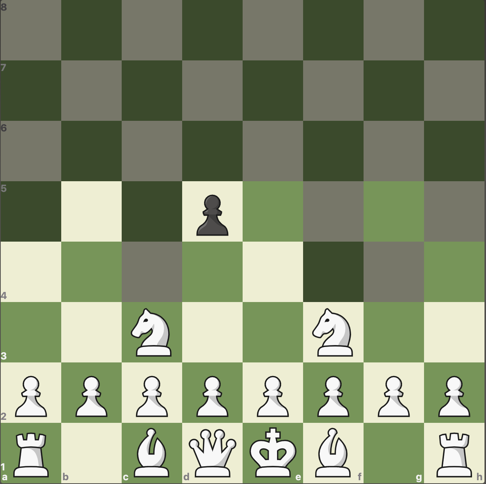
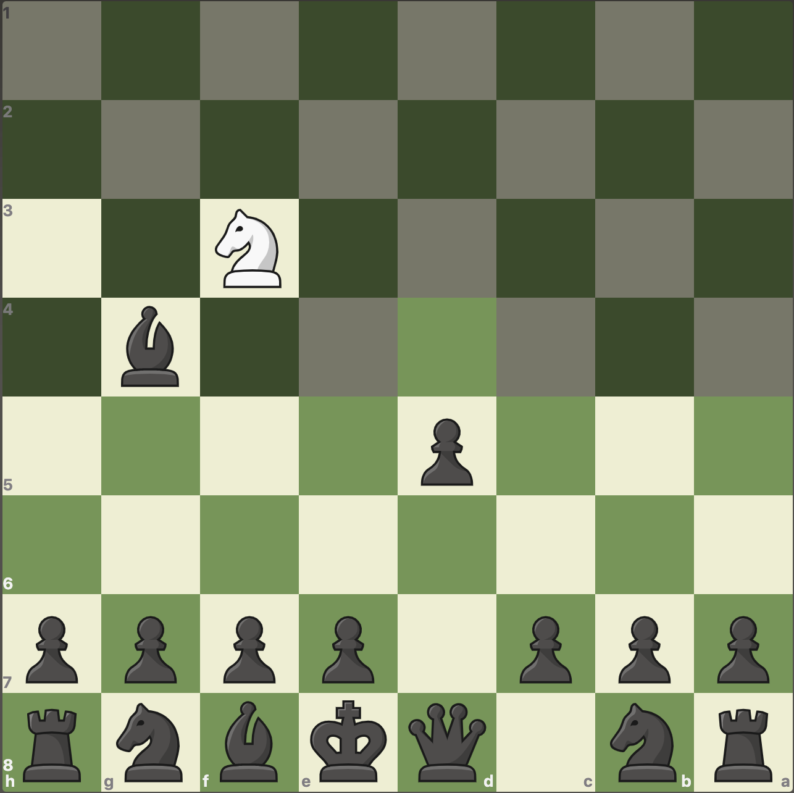
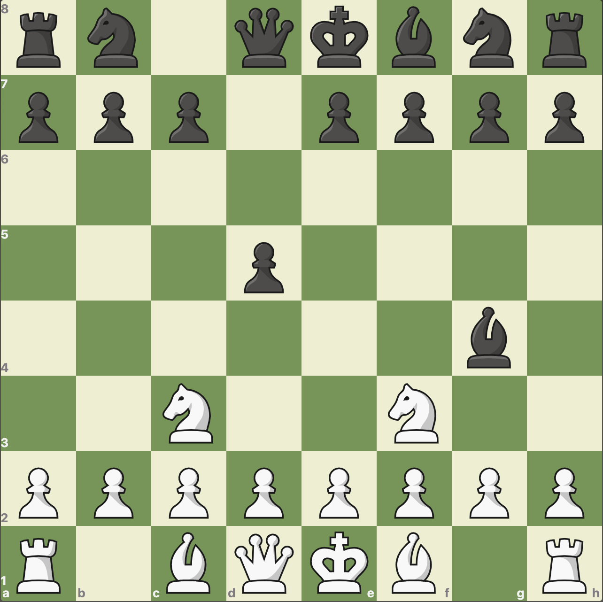

# Fog of War Chess AI
This is my project for COS470: Introduction to Artificial Intelligence. The goal is to create an AI that is capable of competently playing Fog of War Chess. I enjoy playing this chess variant, but have also noticed that there don't seem to be any easily available engines that are capable of playing the game, so I wanted to take on the challenge of making one myself, and this seems like a good opportunity to do so. Below are some links explaining the game and for if you would like to play online against a human opponent.

- [wikipedia entry](https://en.wikipedia.org/wiki/Kriegspiel_%28chess%29)
- [play online](https://www.chess.com/variants/fog-of-war/)
- [possible AI implementations](http://www.finalbot.com/dark-chess.aspx)

### Project Setup
1. Clone the repository
2. While not strictly required, I would reccomend creating a virtual environment to run the program in. 
    - Instructions for installation can be found [here](https://packaging.python.org/guides/installing-using-pip-and-virtual-environments/)
3. Once you have navigated into the project folder `COS470_Fog_of_War` ensure you have all required libraries by running `pip3 install -r requirements.txt`
4. Run the program with `python3 main.py`

### The Game
#### Rules and Introduction
##### Piece Movement
Pieces have the same base movement as in regulat chess, including castling and en passant. Kings are no longer restricted in movement at any time, and may move into check, and in the case of castling they may also move through or into check. (taking the ruleset from what is exhibited on Chess.com, only difference being that pawns that can be captured en passant will be displayed explicitly) 

##### Win Conditions
the game may be won on 3 conditions:
- capture of the opponent king
- resignation of the opposing player
- timeout of the opposing player (may not be relevant in my implementation)

##### Draw Conditions
The game can be drawn on 3 conditions: 
- both players agreeing to a draw, 
- reaching the 50-move rule: when no captures have been made in the last 50 moves (100 ply), and that no pawn moves have been made in the last 50 moves
- threefold repetition: when the exact same board configuration has been reached 3 times in the game
 
both the 50-move rule and threefold repetition are out of the access of the AI, as there is incomplete information about the board, so pawn moves and exact board states will generally not be known.

##### Piece Visibility
The core difference from regular chess is that in Fog of War Chess, a player may only see pieces that may be directly captured, and may only gain information about squares which could otherwise be moved to. This second clause is useful because a square may be inaccessable to a pawn due to a piece on it, so the player has the information that there is a piece there, but will not know what the piece is. 

##### Examples

to demonstrate the idea of piece visibility and inference about what pieces are, I have set up images of the first couple moves of a few games. First is the game beginning with
1. `Nf3` `d5`
2. `Nc3` `Bg4`

Here you can see the game from the perspective of white:
while the board state is not perfectly represented, it is possible to infer the exact setup as the only way black could have a piece on `g4` is to have moved the light-squared bishop with `Bg4`, as you know the other move that was played was `d5`.

From the perspective of black, it is impossible to infer the exact position, white has made 2 moves, and one of them must have been `Nf3` since the other knight could not have made it to `f3` by move 2. the only other information white has access to is that the move was not in the set of `h6`, `e5`, `d5`, `c5`, `g6` of the moves that would normally be legal from
1. `Nf3` `d5`

these are either ruled out by not being visible to the pawn, or by not being visible to the bishop.

For the sake of clarity, here is an unobscured image of the game state from the perspective of white, where all pieces are visible.

For another simple example, in the game beginning with 
1. `e4` `e5`

both players will know that there is a piece in front of their e pawn, but can only determine that the piece is a pawn by inference. 

Some situations are more ambiguous, such as here, where black cannot distinguish
1. `d4` `f5`
2. `Bf4`
from 
1. `d4` `f5`
2. `f4`

as the visible board state would be identical.

Finally, I have taken an [example of a high-level game](https://www.chess.com/variants/fog-of-war/game/11475494/0/1) from the player who is currenty the highest rated player on Chess.com at the time of writing this README.

#### Potential Strategy
Here are some of my opinions about good strategies for Fog of War Chess, alternatively you can look at this [strategy guide](https://docs.google.com/document/u/1/d/1hzyB6aoexikb3RnC1RU53m44-YldHfct8Belce_gyjg/pub) that I found recently.
##### Defense
King defense is obviously a vital part of Fog of War Chess, and is almost more important than in standard chess. Ultimately, there should be a strong priority to defending your king and keeping it safe, which requires that no piece can get access to it. This is likely to be the most important part of the game especially because blind piece moves near the edge of your vision are risky. 

If possible, you do not want your opponent to know where your king is, so if you know it has been seen, move it somewhere else to safety if there are no other immediate threats. It is also worth noting that where around your king needs to be defended varies based on which pieces are still on the board. If there are no knights left, you only need to defend against threats on diagonals and ranks/files. If the queen and a bishop are gone, you can ignore one of the diagonals for threats, ie) if the queen and light-squared bishop have been traded, then keeping the king on light squares is very likely to be safer.

##### Information gathering
As can be seen in the given examples, the state of a board can be inferred even if it is not directly visible. Because of this, one of the critical aspects of the game is information gathering about your opponent position, and because it is a zero-sum game also attempting to give your opponent as little information about yourself as possible is important. Keep track of where a piece came from, and where it could potentially have gone to in the number of moves since its position was known. Additionally, if it is possible to resolve the board to a single state, do so.

In the example game at the end of examples, white can tell the exact board state on move 4 after black moves the king, and for most of the rest of the game is working with very incomplete information. On move 11, white can tell that there is a bishop (or queen, but this is less likely because queen moves that far out tend to be risky) on `f5`. The knight starting on b8 could not have gotten there unseen, as `c6`, `d7`, and `c5` have all seen since move 4, and these are the only ways that knight could have gotten to `f5`. It is likely that by this point that a competent opponent will also have castled to get their king safe, and requiring the dark squared bishop to move, but there is no information about where exactly it is (in the game it is on `g7`, but we don't know that). Similar logic can be used throughout the game to attempt to get a relatively complete view of where your opponent has placed their pieces, but it is difficult to get exact positions, especially towards the end of a game. When there is incomplete information, it is best to be safe where you are unsure. If you know where both knights are, for example, you can be more sparse within reason on defending knights moves away from your king.

##### Offense
I believe offense should be used sparingly, and only when you are sure that it is safe to do so. If your attack weakens your king, it is possible that your opponent can make a stronger counterattack to you and potentially even take your king. Captures should generally only done if trading a lower valued piece for a higher valued piece such as a bishop for a rook or a rook for a queen.
